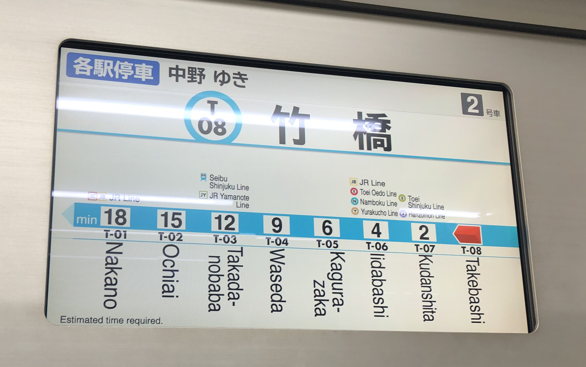

# Tozai Line Train Route Map

From:

Into:

## Decisions

- HTML,
- Plain CSS,
- Simple [CSS Reset](https://www.joshwcomeau.com/css/custom-css-reset/) from Josh W Comeau.
- If you know BEM convention, this [RSCSS](https://rstacruz.github.io/rscss/index.html) is another alternative that I use.
- Following Mark Otto (creator of Bootstrap) [standards](https://codeguide.co/) for the best of us!

## Approach

- I use Gimp software
  - To zoom in-out the image
  - To get hex color of specific area by using Color Picker Tool with "Sample average" checked
- Inkscape for recreating SVGs.
- Copy the Japanese text with Google Translate
